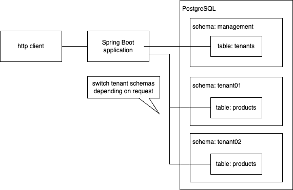

# spring-boot-multi-tenant

This is the example of Spring Boot appliation that use the multi tenant DB (schema base).



## database schema

```sql
create schema management;
create schema tenant01;
create schema tenant02;

create table management.tenants (
  tenant_name varchar(32) primary key,
  schema_name varchar(32) not null
);
create table tenant01.products (
  id serial primary key,
  name varchar(32)
);
create table tenant02.products (
  id serial primary key,
  name varchar(32)
);

insert into management.tenants (tenant_name, schema_name) values ('TENANT 01', 'tenant01');
insert into management.tenants (tenant_name, schema_name) values ('TENANT 02', 'tenant02');
insert into tenant01.products (name) values ('tenant01 product01');
insert into tenant02.products (name) values ('tenant02 product01');
```

## run

```bash
# start database
docker run --name jpa-multi-tenant-postgres -e POSTGRES_PASSWORD=postgres -d -p 5432:5432 postgres:17.4
# create schema with SQL above
docker run -it --rm --network host postgres psql -h localhost -U postgres

# start web server
./gradlew bootRun
```

```bash
# http request
curl "http://localhost:8080/products?tenantId=TENANT%2001"
```
